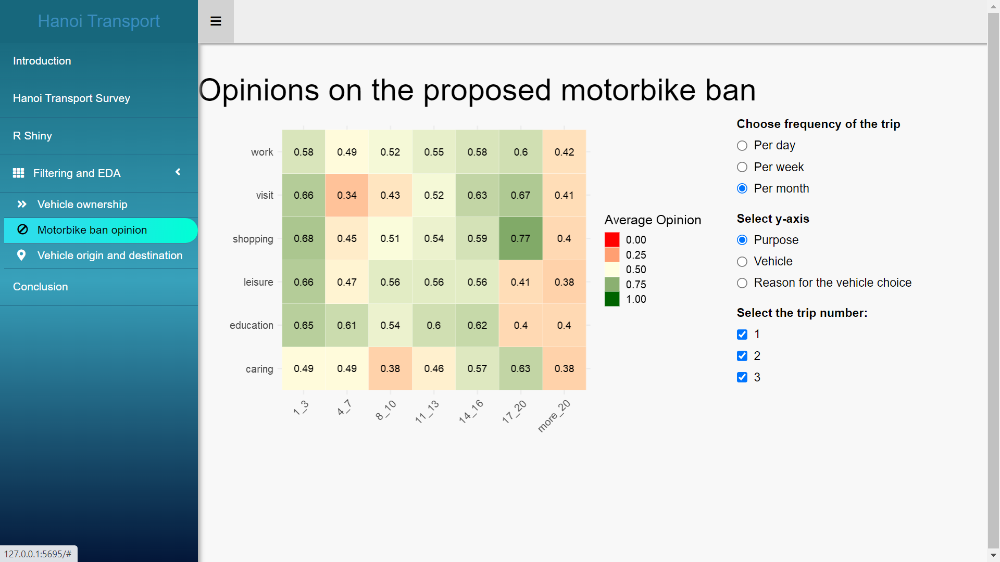
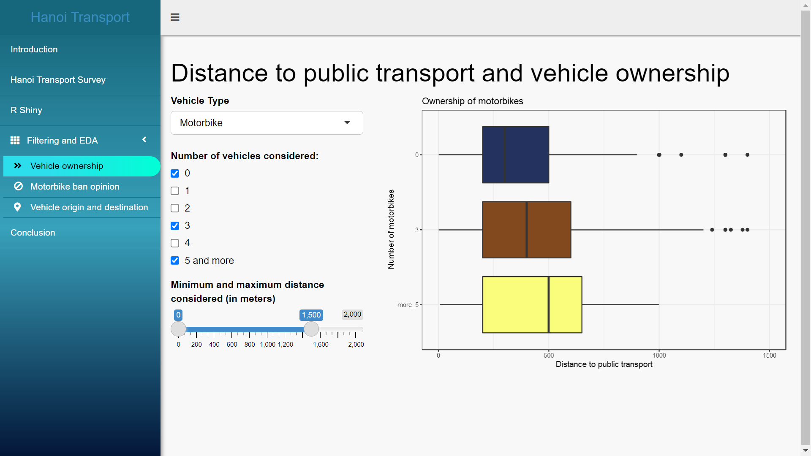
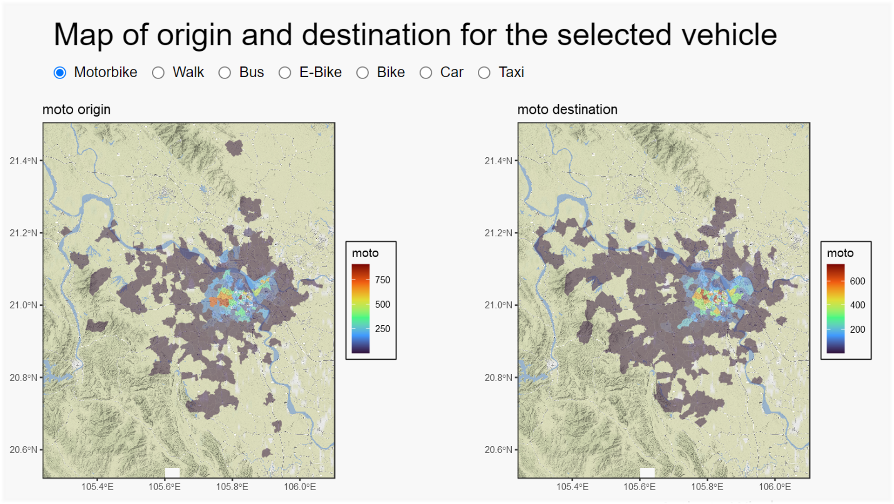

# Let the Data Speak for Itself: Developing a New Data Dashboard for a Hanoi Transport Survey

Author: _Kristina Bratkova_

---

This project developed a dashboard using R Shiny that will be used as a tool to import findings of the travel survey from 26,000 households from wider research team to be communicated to the policy makers in Vietnam in an interactive way.

## Project overview

Hanoi has a population of 8 million people and 89% of households own at least one motorbike. Urban Transport Modelling for Sustainable Well Being in Hanoi project team developed a bespoke survey with responses from 26,000 households. This project developed an interactive dashboard that will serve as a front-end tool for the policy makers. It includes geospatial analysis, exploratory data analysis and input from wider project team; particularly geospatial modelling output from fellow data scientist Eric Wanjau.

## Data and Methods

Shiny is an R package used as a framework for creating web applications. Shiny uses reactive programming to track variable inputs and automatically updates related outputs when an input changes. The dashboard consists of a combination of text content, graphs and maps to communicate the survey findings. The application code consists of two fundamental parts: user interface (what the user sees) and server (how the application works). 

## Key Findings

The transport survey—conducted for the Urban Transport Modelling for Sustainable Well-Being in Hanoi project—includes information about the types of journeys people make (reason, distance, travel time), how they make them (transport mode) and for what reason. The examination of these is supported by respondent socio-economic characteristics (age, gender, occupation, etc.), opinions on the motorbike ban, distance to the nearest stop of public transport, and hypothetical questions about alternative modes of transport and potential vehicle ownership. 

Exploratory data analysis and implementation of interactive widgets are used to visualise numerous findings. First, short-frequency trip-makers tend to agree on the ban and vice versa (Figure 1). Second, distance to the nearest stop of public transport is positively correlated with the number of motorbikes owned per household (Figure 2). However, this relationship wanes for larger distances to public transport (roughly above 1.5 km). Third, certain communes receive more traffic than others per mode of transport, which is important to understand before implementing a potential scenario model (Figure 3).

|  |
| ---   |
| Figure 1. Contingency table (screenshot) of the trip frequencies per month and purpose for the selected trip number (1 and 2). |

|  |
| --- |
| Figure 2. Boxplots (screenshot) of distance to public transport for different numbers of motorbikes owned. |

|  |
| --- |
| Figure 3. Choropleth maps (screenshot) showing total count of motorbike trip origins (left) and destinations (right) per commune. |

## Value of the research 

The dashboard will be used by the policy makers to explore potential scenarios regarding proposed motorbike ban. To illustrate, banning motorbike ban in certain districts will lead to a redistribution of transport modes within Hanoi. Therefore, understanding current and possible future transport behaviours is key factor in implementing policy.

The package structure of the application is also a framework for collaboration in which multiple people can work on the same dashboard independently.

## Insights

 - Distance to the nearest stop of public transport is positively correlated with the number of motorbikes owned per household.
 - This relationship wanes for larger distances to public transport (roughly above 1.5 km).
 - Short-frequency trip makers tend to agree to the motorbike ban and vice versa.
 - A growing number of car users agrees with the ban.

## People and Partners

 - Kristina Bratkova, Data Scientist, Leeds Institute for Data Analytics,
University of Leeds, UK

 - Eric Wanjau, Data Scientist, Leeds Institute for Data Analytics, University of Leeds, UK

 - Prof Nick Malleson, Professor of Spatial Science, Leeds Institute for Data Analytics, University of Leeds, UK

 - Prof Alexis Comber, Professor of Spatial Data Analytics, Leeds Institute for Data Analytics, University of Leeds, UK

 - Dr Minh Le Kieu, Lecturer in Transport Analytics, University of Auckland, New Zealand

 - Phe Hoang Huu, R&D Consultants, Hanoi City, Vietnam

 - Thanh Bui Quang, Faculty of Geography, VNU University of Science, Hanoi, Vietnam

 - Hang Nguyen Thi Thuy, VNU Vietnam Japan University, Vietnam National University, Hanoi, Vietnam

##  Funders

This work has received funding from the British Academy under the Urban Infrastructures of Well-Being programme [grant number UWB190190].

