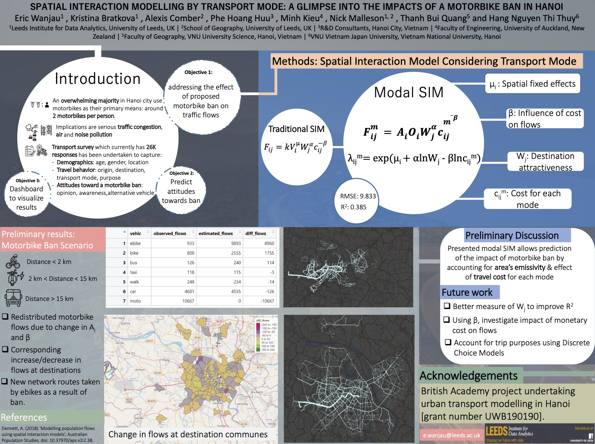

# Presentation and posters for GISRUK 2022

Geographical Information Systems Research UK 2022 ([GISRUK22](http://liverpool.gisruk.org/)) was the 30th conference in the series and held at the University of Liverpol on 5th-8th April.

## Presentation

[**Up-scaling a Spatial Survey with Propensity Score Matching: Implications of a Motorbike Ban in Hanoi**](https://www.nickmalleson.co.uk/p/2022-GISRUK.html). Nick Malleson, Lex Comber, Kristina Bratkova, Phe Hoang Huu, Minh Kieu, Thanh Bui Quang, Hang Nguyen Thi Thuy, and Eric Wanjau. _GIS Research UK (GISRUK)_, 6-8 April 2022, Liverpool UK. 
[{Download}`PDF (abstract)]<./abstract-nick.pdf>`.

## Posters

**Spatial Interaction Modelling by Transport Mode: A Glimpse into the Impacts of A Motorbike Ban in Hanoi.**
Eric Wanjau , Kristina Bratkova, Alexis Comber, Phe Hoang Huu, Minh Kieu, Nick Malleson, Thanh Bui Quang and Hang Nguyen Thi Thuy. 
[{Download}`PDF (poster)]<./poster_eric.pdf>`.

**Let the Data Speak for Itself: Developing a New Data Dashboard for a Hanoi Transport Survey**. 
Kristina Bratkova, Alexis Comber, Phe Hoang Huu, Minh Kieu, Nick Malleson, Thanh Bui Quang, Hang Nguyen Thi Thuy, and Eric Wanjau. 
[{Download}`PDF (poster)]<./poster_kristina.pdf>`.

