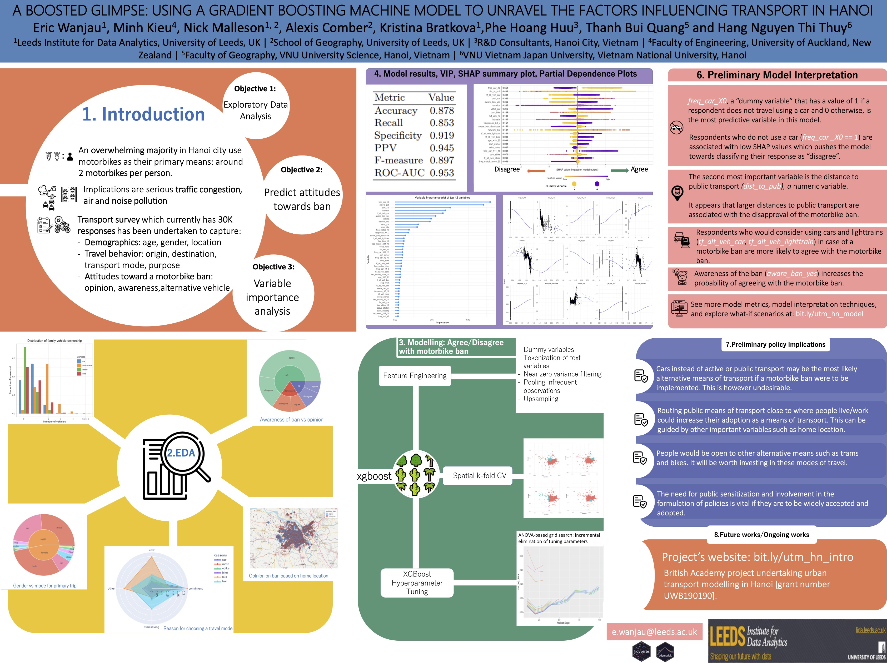

# Poster for RSS 2022

RSS 2022 -- the Royal Statistical Society International Conference 2022 -- was held from 12th-15th September in Aberdeen, UK. Eric Wanjau presented the following poster:

**A boosted glimpse: using a gradient boosting machine model to unravel the factors influencing transport in Hanoi**
Eric Wanjau, Minh Kieu, Nick Malleson, Alexis Comber, Kristina Bratkova, Phe Hoang Huu, Thanh Bui Quang and Hang Nguyen Thi Thuy.
[{Download}`PDF (poster)]<./poster-eric.pdf>`.

